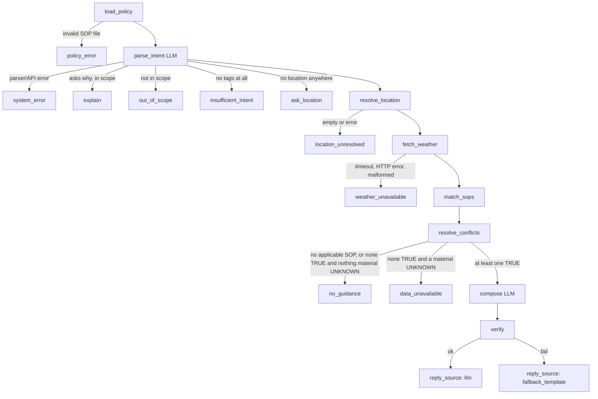

# Weather-Advisory Support Bot

A LangGraph chat bot that answers outdoor-activity safety questions **only from written policies (SOPs)** applied to
live Open-Meteo weather. The model never decides facts: it (a) turns the question into structured fields and
(b) rephrases advice that code has already chosen. Everything else is deterministic code.

> **Honest project status is in [Status](#status-what-is-done-and-what-is-not).** Short version: the engine, graph,
> UI, SOPs and both eval suites are built and tested; the real `sops/sops.yaml` (21 SOPs) is now exercised
> end-to-end (user suite 30 PASS / 0 FAIL / 1 live SKIPPED, `pytest` 93 passed). A senior-review pass fixed
> three real defects — see [`REVIEW_REPORT.md`](REVIEW_REPORT.md). **Caveats:** the LLM tier here ran at N=1
> (project bar is N=3; two fixture cases show provider-429 INFRA ERROR), and the live S2 case PASSes only when
> severe weather is actually active (today it SKIPPED).

## Setup and run

Requires Python 3.12. Dependencies are in `requirements.txt` (installed here with `uv`, no sudo).

```bash
# one-time
uv venv venv && uv pip install --python venv/bin/python -r requirements.txt
cp .env.example .env        # then edit .env
```
`.env` (gitignored; never commit it):
```
OPENAI_API_KEY=...          # key for the OpenAI-compatible endpoint below
OPENAI_MODEL=...            # exact model name; never defaulted in code
OPENAI_BASE_URL=https://api.groq.com/openai/v1   # Groq; leave empty for OpenAI
```
The LLM is `langchain-openai` `ChatOpenAI`, temperature 0, structured output (`function_calling`) for intent parsing.
It is capped at `max_tokens=4096` with automatic retries (`max_retries=3`, exponential backoff on timeouts/5xx/429)
and a 30 s timeout; the composer is instructed to keep replies under 100 words. All three are env-tunable
(`OPENAI_MAX_TOKENS`, `OPENAI_MAX_RETRIES`, `OPENAI_TIMEOUT_S` — see `.env.example`). Retries do not help a
provider's *daily* token-quota 429, which only resets with time.

**Backend only (no UI):**
```python
from weather_advisor.factory import build_default_app
from weather_advisor.graph import ask
app = build_default_app()                      # uses sops/sops.yaml (or $SOP_FILE)
print(ask(app, "my-thread", "Is it safe to cycle in Bhopal today?")["reply"])
```
**Frontend (Streamlit):** `venv/bin/streamlit run app.py`. Chat thread, a "New chat" button in the sidebar (new
`thread_id`), and a "Why this answer" expander under every reply showing the full trace. The UI contains no policy,
weather, matching or verification logic; it only calls `ask()`.
Use the dummy SOPs without your real file: `SOP_FILE=tests/fixtures/sops_fixture.yaml venv/bin/streamlit run app.py`.

**How to talk to it:** see [`USECASES.md`](USECASES.md) — say it once (activity + city), then type only the delta
(`tonight?`, `what about Delhi?`, `why?`); the session carries the rest forward.

**Deploying:** see [`DEPLOY.md`](DEPLOY.md). This is a Streamlit server, so it needs a Python host
(Streamlit Community Cloud is the one-click option) — not a static host like Netlify.

**Tests:** `venv/bin/python -m pytest -q` (89 tests; no network, no LLM).
**Evals:** `venv/bin/python evals/run_evals.py --suite fixture|user [--mode engine|e2e|all] [--runs 3] [--case ID]`.
Fixture suite -> `evals/RESULTS.md`; user suite -> `evals/RESULTS_user.md`. Analysis in `evals/NOTES.md`.
**Secret scan:** `venv/bin/python scripts/audit_secrets.py` (working tree + full git history).

## The SOP file (`sops/sops.yaml`)

**Why one YAML file:** one human-readable, diffable, hot-reloadable source of truth that a non-engineer can edit and
the loader can validate completely; the file is re-read from disk on **every request**, so edits apply with no restart.

**Honest tradeoffs:** no per-SOP ownership, review workflow or versioning (git history is the only audit trail); a
big file gets unwieldy; one typo can invalidate everything (by design the bot then refuses to answer rather than
guess: branch `policy_error`); and a YAML-only condition language is limited to the grammar below.

Sections: `meta`, `messages`, `vocabulary`, `sops`.
- `meta`: `schema_version`, ordered `severities` (low to high), `disclose_unknown_from` (a severity),
  `default_time_reference` (a `time_words` tag with a window), `id_pattern`.
- **`meta.id_pattern`** is **schema-level identifier validation, not policy logic.** It is a regex defining the SOP
  ID namespace. The loader requires every SOP `id` to fully match it, and the verifier uses it to recognise SOP IDs
  in a composed reply (so an invented `SOP-99` can be rejected while `UTC-5` is not mistaken for an ID).
- `messages`: wording of the fixed templates (`no_guidance`, `out_of_scope`, `insufficient_intent`, `ask_location`,
  `location_unresolved`, `weather_unavailable`, `data_unavailable`, `no_prior_decision`, `unknown_disclosure`).
  Only `unknown_disclosure` may contain placeholders (`{sop_id} {title} {severity}`).
- `vocabulary`: `activities`, `groups`, `question_types` (tag -> description to help the LLM map paraphrases) and
  `time_words` (tag -> description and optional window). The parser's allowed tag values are built from this at
  runtime (`llm.intent_model`), never hardcoded.
- Each SOP: `id, title, category, severity, priority, applies_to, requires, condition, advice, rationale`, optional
  `edge_cases`, `override`.
  - `applies_to`: for each of `activities/groups/question_types`, a non-empty tag list or `any`. Dimensions AND, tags
    within a list OR; if the question has no tag for a restricted dimension the SOP does not apply (never guessed).
  - `requires`: `{field, source: current|hourly|daily}`; the **union over all SOPs** is what is requested from Open-Meteo.
  - `condition` (exactly one key per node): `compare` (current/daily value; `> >= < <= == !=`, `in`, `not_in`),
    `window_agg` (`max|min|mean|sum` over hourly data in a window), `score` (fuzzy, below), and `all` / `any` / `not`.
    Windows are whole local hours, start inclusive, end exclusive: `fixed_local: {start, end}` or
    `from_time_reference: true` (window taken from the user's time word via `vocabulary.time_words`).
  - Logic is three-valued: TRUE / FALSE / UNKNOWN. A null or missing value (or any missing hour in a window) is
    UNKNOWN and **never** becomes TRUE.
  - **Fuzzy SOPs** use `score`: deterministic weighted score over several fields (`weight * points` per term from
    ordered `bands`, normalised to 0..1, compared to `match`, optional `labels`). The LLM never judges the outcome.
  - `advice` placeholders (`{name}`) are filled by code only from evaluated evidence (`as:` names).
  - `override: true`: see conflict resolution. It is a precedence flag, not a condition type.
- `sops/sops.yaml` today is an **annotated skeleton** (10 slots, edge-case checklists, TODOs) and deliberately fails
  validation until the author fills it in. `tests/fixtures/sops_fixture.yaml` holds 11 clearly-labelled **DUMMY**
  SOPs (6 categories, 4 severities, one fuzzy, one situational override) for tests and evals; they are never mixed.

## Graph


Every terminal branch is its own node, so the trace names exactly what happened.

| Branch | Why it exists |
|---|---|
| `policy_error` | A broken SOP file must never produce advice; fixed emergency text (`graph.POLICY_ERROR_TEXT`) because the file's own `messages` can't be trusted. |
| `system_error` | If the intent parser/LLM fails, say so rather than guess an intent. |
| `explain` | "Why did you say that?" is answered deterministically from the decision log + SOP rationale, never by a fresh LLM story. Checked before out-of-scope, but only honoured when the parser also deems the request in scope. |
| `out_of_scope` / `insufficient_intent` / `ask_location` | Fixed templates; no weather is fetched for a question we can't use. Insufficient = activities, groups and question types all empty. |
| `location_unresolved` | Empty or errored geocoding gets the same honest fallback as a weather failure. The first geocoding candidate is used; all candidates are in the trace and the resolved place is stated in the reply. |
| `weather_unavailable` | Timeout, connection error, HTTP error, malformed/unusable payload: no numbers, no advice, no guess, no compose call. |
| `no_guidance` | In-scope but no applicable SOP evaluated TRUE (and no material UNKNOWN): "no guidance", no compose call. |
| `data_unavailable` | Relevant policy could not be evaluated because data was null: deliberately distinct from `no_guidance` so the bot never implies "no policy exists". |
| `compose` -> `verify` | The only LLM-written reply. Verified; on any failure the deterministic rendering of the approved advice is returned (no retry). |

Session memory: `MemorySaver`, one `thread_id` per chat; per thread it keeps messages, structured session facts and a
decision log (SOP IDs, severity, evidence, location, snapshot time, outcome, including no-guidance and
data-unavailable turns). Weather is re-fetched every turn. A user-stated field replaces the stored one; an unstated
field is inherited; the configured `default_time_reference` is used only if there is neither (`graph.parse_intent`).
Inherited fields are recorded in the trace. Memory is in-process only; "New chat" starts a fresh thread.

## Conflict resolution (decided on purpose)

When several SOPs are TRUE for one question (`engine.resolve_conflicts`):
1. If any TRUE SOP has `override: true`, it is **primary**.
2. Otherwise, highest **severity** (order from `meta.severities`).
3. Ties: **larger `priority` number wins**.
4. Ties: SOP ID ascending (deterministic).
Everything else that is TRUE becomes **secondary**; each is cited by ID with its own deterministic advice (the LLM
may rephrase it but not add to it). SOPs whose result is UNKNOWN at or above `meta.disclose_unknown_from` are
disclosed in the reply (and the trace); lower-severity UNKNOWNs are traced only.

**Why this rule:** a user in danger must see the most severe policy first, but silently dropping a second applicable
policy (e.g. high UV *and* strong wind) would hide a real risk, so primary-plus-secondaries is the compromise. The
PDF's "bigger than any single threshold" rain-system example is handled as an ordinary SOP that combines signals
with `all`/`any` and sets `override: true`, so it leads **regardless of the severities of the single-threshold SOPs**,
without a special condition type. Alternatives rejected: "answer with only the winner" (hides risks) and "list
everything by severity" (no deliberate lead, and the situational case could be buried).

## PDF requirement -> where it is enforced

| PDF requirement | File / function | Test / eval |
|---|---|---|
| Real LangGraph with real branching, incl. failure paths | `graph.py: build_graph` (conditional edges after `load_policy`, `parse_intent`, `resolve_location`, `fetch_weather`, `resolve_conflicts`) | `tests/test_graph.py`; evals F1-F5, N1, N2, U1 |
| **NN1** Every answer traceable to an SOP or an explicit "no SOP applies" | `engine.py: resolve_conflicts`; `graph.py: resolve_conflicts`, `render_approved`, `verify` (requires cited IDs), no-guidance/data-unavailable nodes; trace + `explain` | evals A1, N1, U1, M4; `test_graph.py::test_explain_*` |
| **NN2** Changing a policy needs no change to fetch/model code | `sops.py: load_sops/validate_sops`; `graph.py: load_policy` (re-read per request); `SOPSet.required_fields` -> `weather.forecast_params`; `llm.py: intent_model` builds tags from the file | evals L1, L2, L3; `test_graph.py::test_sop_file_is_reread_each_request` |
| **NN3** Never answer with a forecast it doesn't have | `graph.py: resolve_location, fetch_weather` -> `location_unresolved` / `weather_unavailable`; `weather.py: build_snapshot` (rejects unusable payloads), `WeatherError` | evals F1-F5; `test_graph.py::test_faults_fail_honestly` |
| **NN4** Never invent generic advice when no policy covers it | `engine.py: resolve_conflicts` outcome; `graph.py` `no_guidance` / `data_unavailable` nodes (fixed templates, no compose call) | evals N1, U1; `test_graph.py::test_no_guidance_*` |
| **NN5** Reported numbers are the ones from the API for that request | `conditions.py: render_advice, fmt_number` (code fills every value from evidence); compose gets only approved text (`graph.py: resolve_conflicts` builds the payload, never the user text); `verify.py: verify_reply` rejects any number code did not place; `graph.py: verify` falls back deterministically | evals A1, A2, S1, V1, X0, X3; `tests/test_llm_verify.py` |
| Session memory across turns | `graph.py: State`, `parse_intent` (merge), `decision_log`, `summarize_log`; `MemorySaver` | evals M1-M4; `test_graph.py::test_session_*` |
| SOPs: >=10, >=3 categories, range of severities, fuzzy, situational | Schema supports all (`sops.py`, `conditions.py: _score`, `override`); fixture meets them | `test_sops_loader.py::test_fixture_loads_and_meets_shape`; real file (21 SOPs, 15 categories, advisory/warning/critical, fuzzy WA-19, situational override WA-20): `test_real_sops_file_loads_and_meets_shape` |
| Multiple SOPs may apply: decide on purpose | `engine.py: resolve_conflicts` (documented above) | evals C1, S1; `test_graph.py::test_conflict_*`, `test_override_*` |
| Geocoding ambiguity / failure handled | `graph.py: resolve_location`; `weather.py: OpenMeteoClient.geocode` | evals G1, F2, F3 |
| Chat frontend | `app.py` | `tests/test_app_smoke.py` |
| Eval suite with results and honest notes | `evals/run_evals.py`, `evals/RESULTS.md`, `evals/NOTES.md` | the suite itself, plus mutation checks recorded in NOTES |
| Add an 11th SOP live without touching control-flow code | edit the YAML only | eval L1 (fixture: PASS; real file: PASS, see Status) |

## No-code-change: where it is weaker than it looks

New SOPs that only combine existing pieces (new thresholds, fields, tags, messages, windows, `all/any/not`,
`in`/`not_in`, score terms) need **no Python change**, and L1/L2 prove it on the fixture file. It breaks down when:
- a **new aggregation** (percentile, count-of-hours-above, change over time) or a **new operator** is needed: it must
  be added to `conditions.py` and the validator (`AGGS`, `CMP_OPS`/`SET_OPS` in `sops.py`);
- the concept **isn't an Open-Meteo field** (air quality, official IMD/NWS alerts, pollen, derived indices): there is
  no data source for it without new client code. "Low-pressure system" must be defined by you from fields Open-Meteo
  exposes; this is yours to define (D5);
- it needs a **new data section** beyond current/hourly/daily, windows that aren't whole hours, windows on days other
  than today/tomorrow, or non-numeric comparisons beyond set membership;
- a **new vocabulary tag** works only as well as the LLM maps paraphrases to it (the `description` text matters) and
  needs to be checked with an LLM-tier case;
- a **mistyped or unsupported Open-Meteo field name** makes the whole forecast request fail (HTTP 400), so it shows as
  `weather_unavailable` for every question rather than as an SOP error. The loader cannot know Open-Meteo's field
  list without hardcoding it. After editing `requires`, run one live question. (This exact failure was found and
  fixed in review: WA-17 had required `surface_runoff`, which the `/v1/forecast` endpoint rejects — see `REVIEW_REPORT.md`.)
- a **new message key or placeholder** needs the schema updated (`REQUIRED_MESSAGES`, `MESSAGE_PLACEHOLDERS`);
- `meta.id_pattern` must match any new ID.

## Known limitations

- **Fixed wording in code:** the reply layout, `explain` text, `POLICY_ERROR_TEXT` and `SYSTEM_ERROR_TEXT` live in
  `graph.py`. They contain no SOP content. All SOP advice and template messages live in the YAML.
- **Verifier scope:** numbers spelled as words ("fifty") are not checked (compose is told to use digits); allowed
  numbers are stricter than the PDF (only numbers code already placed in the approved text), so a reply that adds a
  harmless extra number falls back to the deterministic text.
- **Parser sees the raw question.** Injection can at worst cause wrong tags, `out_of_scope` or `system_error`; it
  cannot change SOP text or numbers. Resistance of the parser itself is measured only by the LLM-tier evals.
- **Session inheritance** carries unstated activity/group/question-type values forward, so an earlier "my elderly
  mother" keeps applying until replaced or "New chat". `explain` covers only the most recent decision.
- First geocoding candidate only; two forecast days (today and tomorrow); no sub-hour windows; no cross-session memory;
  `MemorySaver` is in-process and the Streamlit graph is shared by all browser sessions (threads keep them apart).
- Structured output uses `function_calling`; whether a specific Groq model supports it was verified only by the
  eval runs recorded below, not in general.
- Fixture weather is hand-written, not recorded; schema drift in Open-Meteo would only be caught by live runs.
- Windows reflect the API's local time; "tomorrow" is the next local calendar date.

## Status: what is done and what is not

See the generated `evals/RESULTS.md` for per-case detail. Updated after the final runs:

| Item | State |
|---|---|
A senior-review corrective pass fixed three real defects (one app-breaking on live data); see
[`REVIEW_REPORT.md`](REVIEW_REPORT.md) and the addendum in `evals/NOTES.md`.

| Item | State |
|---|---|
| Unit/integration tests (`pytest -q`, no network or LLM) | **PASS: 93 passed, 0 failed, 0 errors** (WSL, `venv/bin/python`; also passes on Windows `venv\Scripts\python.exe` when the OS temp dir is healthy, see the next row). |
| Windows `pytest` temp directory | **INFRASTRUCTURE BLOCKED on the author's machine, not a repo defect.** `C:\Users\<user>\AppData\Local\Temp\pytest-of-<user>` is a stale directory with a broken ACL (`PermissionError [WinError 5]`; `icacls` and rename are also denied), so tests using `tmp_path` error in setup. With a fresh `TEMP`/`--basetemp` all pass. Fix: from an elevated shell, `takeown /f "%TEMP%\pytest-of-%USERNAME%" /r /d y` then `icacls ... /grant %USERNAME%:F /t`, or delete that directory. |
| **Live forecast against real Open-Meteo** | **PASS (fixed this pass).** WA-17 previously required `surface_runoff`, which the standard `/v1/forecast` endpoint this client uses rejects with HTTP 400 (verified in `current=`/`hourly=` and with `models=` overrides). Since `required_fields()` unions all SOP fields into one request, that single field broke weather retrieval for *every* live query (hidden by the fixture client). WA-17 now uses accumulated `precipitation`; a live request with the full field union succeeds. |
| **LLM composition accepted on the real file** | **PASS (fixed this pass).** The real file's anchored `id_pattern` (`^WA-[0-9]{2}$`) made the verifier reject every faithful LLM reply (silent fallback). `verify._namespace_pattern` now strips outer `^`/`$`; regression-tested. |
| Real `sops/sops.yaml` | **COMPLETE.** 21 SOPs, 15 categories, severities advisory x5 / warning x11 / critical x5, fuzzy SOP WA-19, situational override WA-20 (covers **all** question types), plus WA-21 cycling/two-wheeler high-wind. Loads and validates. |
| Fixture eval suite, deterministic tier (engine + X0, V1, L1-L4) | **PASS** (32 rows), mutation-checked (see `evals/NOTES.md`). |
| Fixture eval suite, LLM tier (`openai/gpt-oss-20b` on Groq) | **52 PASS / 0 FAIL / 2 INFRA ERROR** at N=1 (`--mode all --runs 1`, `evals/RESULTS.md`). The 2 INFRA ERRORs (M2, X4) are the provider's 429 token-per-day limit, not system verdicts; both PASSed in the earlier N=1 run the same day. A clean N=3 run still needs fresh quota. |
| **User eval suite on the real SOPs** (`evals/cases_user.yaml`) | **PASS: 30 PASS / 0 FAIL / 1 SKIPPED** (`--mode all --runs 1`). 27 real-SOP cases exercise all 21 SOPs through the full graph (≥2 clear matches, ≥2 paraphrases, override, no-match, API-fail, adversarial, conflict, boundary, UNKNOWN, fuzzy, memory). L1/L3/L4 PASS (L4 coverage 21/21). |
| 11th-SOP test (L1) on the **real** SOP file | **PASS** (`params.new_id: WA-22`): temp copy grows 21 -> 22 SOPs, the new id is matched and cited, the new field is requested from the API; the unmodified file does not cite it. `src/`, `sops/`, `app.py` byte-identical before and after. |
| **S2 live severe-weather case** | **Configured and ran live today -> SKIPPED** (`severe_sop_ids: [WA-20]`; no candidate city had a severe SOP TRUE today). **Date-dependent by design:** PASS only when a configured severe SOP is live; never a fabricated PASS. Fixture S1 / user UOVR cover severe-weather logic every day. |
| Git history | No commits yet (the repo was initialised with `git init`; branch is `master`). |
| Secret scan | See below. |

**Honest caveats:** the LLM tier here ran at N=1 (the project's stricter bar is N=3); two fixture cases
show INFRA ERROR from provider rate limits; S2 is PASS-capable only when severe weather is live.

### Secret scan (`scripts/audit_secrets.py`)
- Working tree: **PASS**, no key-like strings in any committable file (re-run after the final fixes). `.env` (your real key) and editor copies under
  `.history/` do contain keys; both are gitignored, so they will not be committed (`.history/` was added to
  `.gitignore` for that reason; it is not in the original required list).
- Git history: **0 commits exist yet, so there is nothing to scan.** After you make your final commit(s), rerun
  `venv/bin/python scripts/audit_secrets.py`; it scans the working tree and `git log --all -p`, reports only
  redacted findings, exits non-zero on a hit, and never rewrites history.
